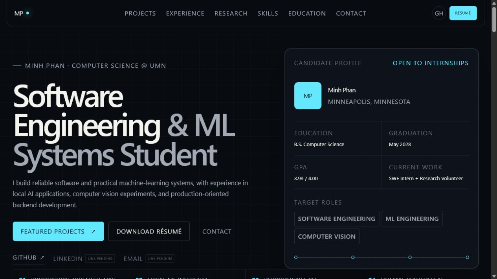

# Minh Phan — ML Engineering & Systems Portfolio

Recruiter-focused portfolio for Minh Phan (Quang Minh Phan), a Computer Science student at the University of Minnesota Twin Cities.



## What is included

- ML-engineering-oriented hero and candidate summary
- Featured case studies for Shape of Noise, the aerial benchmark, and NoteFlow
- Software engineering internship and undergraduate research experience
- Public CTB at ICML 2026 paper links and measured robustness results
- Workflow-oriented technical skills and education
- Verified email, GitHub, and résumé links
- Responsive navigation, accessible dialogs, reduced-motion support, and focus states
- Original Open Graph image, structured data, canonical metadata, robots, and sitemap
- GitHub Pages static export plus OpenAI Sites configuration

## Stack

React 19 · TypeScript · Vinext/Vite · hand-authored CSS · Node test runner · GitHub Actions

## Run locally

Requires Node.js 22+ and npm.

```bash
npm ci
npm run dev
```

Open `http://localhost:3000`.

## Verify

```bash
npm run lint
npm run typecheck
npm test
```

`npm test` builds the application, exports the GitHub Pages artifact under the repository base path, and validates content, metadata, accessibility hooks, and public assets.

## Deploy

The GitHub Actions workflow publishes `main` to:

`https://harryphan72007.github.io/minh-phan-portfolio/`

The `.openai/hosting.json` file binds this source to its existing OpenAI Sites project.

## Accuracy policy

- Employment and volunteer research are labeled separately.
- Shape of Noise is described as accepted to CTB at ICML 2026 and links to the public manuscript.
- Aerial benchmark results remain `TBD` until real runs exist.
- NoteFlow screenshots and records are explicitly synthetic.
- Mega-ASR is described as internship experience; private employer code and checkpoints are not published.
- No third-party repository, metric, or professional link is added without verification.
